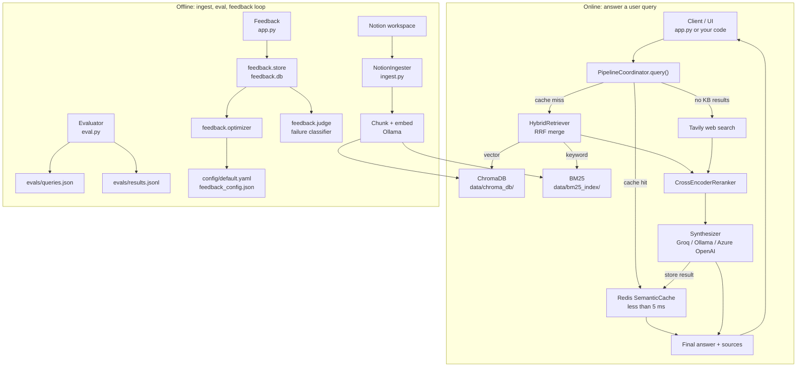

# Agentic RAG

Local agentic RAG system using Ollama (llama3.2) and a Notion knowledge base. Optionally uses Groq or Azure OpenAI for fast cloud synthesis and Redis for semantic caching.

## Prerequisites

- **Python 3.12+** and **[uv](https://docs.astral.sh/uv/getting-started/installation/)**
- **[Ollama](https://ollama.com)** — runs on your host in both local and Docker setups
- **[Tesseract](https://github.com/tesseract-ocr/tesseract)** — OCR for image blocks (`brew install tesseract` on macOS)
- **Groq** *(optional)* — cloud LLM for fast synthesis; set `GROQ_API_KEY` in `.env`
- **Azure OpenAI** *(optional)* — alternative cloud LLM; set `AZURE_OPENAI_API_KEY` + endpoint in `.env`
- **Redis** *(optional)* — semantic cache; cache hits return in < 5 ms (`brew install redis && brew services start redis` on macOS)

See [CONTRIBUTING.md](CONTRIBUTING.md) for setup and run instructions.

---

## UI (Streamlit)

The sidebar shows live **service health** (Ollama, Redis, Groq, ChromaDB) and a **Chunking** tool to paste text and preview chunk counts for different `ingestion.chunk_size` / `ingestion.chunk_overlap` values.

### Notion setup

1. Go to [notion.so/my-integrations](https://www.notion.so/my-integrations) → create an **Internal Integration** → copy the secret.
2. For each page to index: open the page → **"..."** → **"Connect to"** → select your integration.

Store the token in `.env` at the project root:
```
NOTION_TOKEN=secret_xxx
```

## Ingestion

Ingestion builds both a ChromaDB vector index and a BM25 index (`./data/bm25_index/`). Queries use both via Reciprocal Rank Fusion — BM25 catches exact keyword matches that vector search can miss. Incremental mode (default) uses `last_edited_time` to skip unchanged pages and prunes deleted ones. Use `--full` after changing chunking settings.

Image blocks are processed with OCR (Tesseract) and optionally captioned via `llava`.

See [CONTRIBUTING.md](CONTRIBUTING.md) for ingest commands.

## Configuration

Settings live in `config/default.yaml` (local) and `config/docker.yaml` (Docker) and are loaded into typed dataclasses at startup:

```yaml
chroma_path: ./data/chroma_db
bm25_path: ./data/bm25_index
collection_name: notion_kb
max_tool_calls: 5

llm:
  model: llama3.2
  embed_model: nomic-embed-text
  base_url: http://localhost:11434    # docker.yaml uses http://host.docker.internal:11434

retriever:
  min_similarity: 0.50        # cosine similarity cutoff for vector candidates
  top_n: 20                   # RRF candidates passed to reranker
  rrf_k: 60                   # RRF damping constant
  bm25_top_k: 10              # BM25 candidates before merge
  reranker_model: cross-encoder/ms-marco-MiniLM-L-2-v2
  reranker_top_k: 5           # results returned after reranking
  few_shot_max: 3             # max thumbs-up examples injected into the prompt

ingestion:
  chunk_size: 800
  chunk_overlap: 100
  vision_model: llava         # Ollama model used for image captioning

# Optional: Groq for fast cloud synthesis (falls back to Ollama if absent)
groq:
  model: "llama-3.1-8b-instant"
  # api_key: set via GROQ_API_KEY env var (never in config file)

# Optional: Azure OpenAI (alternative to Groq)
azure_openai:
  endpoint: ""                # set via AZURE_OPENAI_ENDPOINT env var
  deployment: "gpt-4o-mini"
  api_version: "2024-02-01"
  # api_key: set via AZURE_OPENAI_API_KEY env var

# Optional: Redis semantic cache
redis:
  url: "redis://localhost:6379"     # docker.yaml uses redis://redis:6379
  ttl_seconds: 3600
  similarity_threshold: 0.95  # cosine similarity required for a cache hit
```

### Groq setup

```bash
# 1. Create an account at console.groq.com and generate an API key
# 2. Add to .env (never commit this file):
GROQ_API_KEY=gsk_...
```

### Azure OpenAI setup (alternative to Groq)

```bash
# Add to .env:
AZURE_OPENAI_API_KEY=...
AZURE_OPENAI_ENDPOINT=https://<your-resource>.openai.azure.com/
```

## Eval

```bash
# Edit evals/queries.json with your test queries, then:
uv run python scripts/eval.py           # run queries and rate answers interactively
uv run python scripts/eval.py --report  # print pass-rate summary from saved results
```

Results are saved to `evals/results.jsonl`.

## Optional: Langfuse tracing

This repo has optional Langfuse tracing for LangGraph runs + Ollama calls. When enabled:

- `main.AgenticRAGSystem.query()` returns a `trace_id`
- `eval.py` logs your `[y/n]` rating back to Langfuse as a `human_rating` score

```bash
uv add langfuse
export LANGFUSE_PUBLIC_KEY=...
export LANGFUSE_SECRET_KEY=...
export LANGFUSE_HOST=...   # optional (cloud or self-hosted)
```

## Conversation memory (follow-ups)

To answer follow-up questions, the app keeps a rolling in-memory chat history per `thread_id` and uses it as extra context for retrieval + synthesis. Pass a stable `thread_id` when calling `AgenticRAGSystem.query()`. The Streamlit UI automatically generates a per-session `thread_id`.

## Architecture



`PipelineCoordinator` runs sources in priority order: `RAGSource` first, `WebSource` only if the KB returns no vector results above `min_similarity`. Conversation memory is per `thread_id`.

```
src/agentic_rag/
├── config.py          # RAGConfig dataclasses + YAML loader
├── models.py
├── cache/             # SemanticCache (Redis, cosine similarity)
├── ingestion/         # Notion fetching, chunking, embedding (+ image captioning)
├── retrieval/         # ChromaDB, BM25, hybrid RRF, cross-encoder reranker
├── pipeline/          # PipelineCoordinator, sources, synthesizer, memory
├── llm/               # BaseLLM, OllamaLLM, OpenAICompatLLM (Groq + Azure)
├── health.py          # startup dependency checks
├── feedback/          # Store + judge + optimizer (feedback loop)
├── observability/     # Langfuse tracing/scoring
├── evaluation/        # Evaluator logic (reads/writes evals/)
└── utils/             # shared helpers (errors, etc.)
```

```
repo/
├── app.py             # Streamlit UI (query + feedback + background ingest)
├── scripts/
│   ├── ingest.py      # CLI wrapper for NotionIngester
│   ├── eval.py        # CLI wrapper for Evaluator
│   └── main.py        # non-UI query entrypoint
├── config/
│   ├── default.yaml   # local config
│   └── docker.yaml    # Docker config (Ollama + Redis URLs differ)
├── data/
│   ├── chroma_db/         # ChromaDB vector index (generated)
│   ├── bm25_index/        # BM25 index (generated)
│   ├── feedback_config.json  # few-shot examples (auto-written by optimizer)
│   └── feedback.db        # SQLite feedback store (gitignored)
├── evals/
│   ├── queries.json   # eval inputs
│   └── results.jsonl  # eval outputs (generated)
├── tests/
│   ├── unit/
│   └── integration/
└── src/agentic_rag/    # library code (see above)
```

## Development

See [CONTRIBUTING.md](CONTRIBUTING.md).
